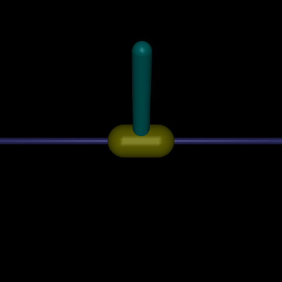
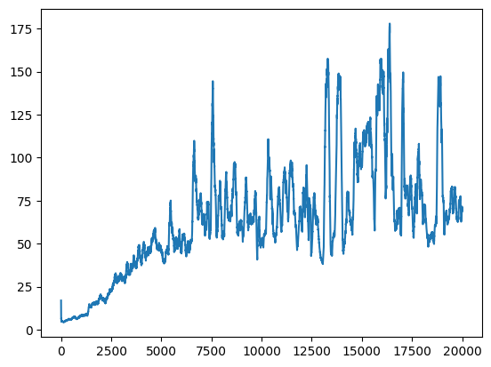
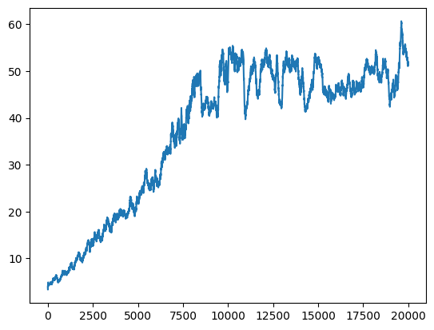
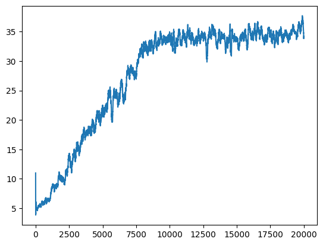
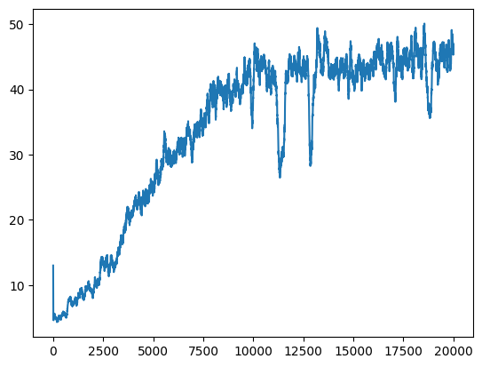

# Aprendizaje por Refuerzo I

## Péndulo Invertido

### Alumno: Kevin Cajachuán

#### Repositorio: [https://github.com/Kajachuan/ar1](https://github.com/Kajachuan/ar1)

Para resolver el desafío se eligió resolver el problema del péndulo invertido. Para resolver dicho problema se puede utilizar el entorno ya existente de la librería MuJoCo que forma parte de Gymnasium (InvertedPendulum-v5). Se puede observar un ejemplo de visualización de dicho problema en la siguiente figura.

<center></center>

Tal como lo dice la [documentación](https://gymnasium.farama.org/environments/mujoco/inverted_pendulum/), es el mismo problema del [CartPole](https://gymnasium.farama.org/environments/classic_control/cart_pole/) pero adaptado al entorno de MuJoCo. Una de las consecuencias de esto es que el espacio de acciones para este problema pasa a ser continuo con -3 como valor mínimo y 3 como valor máximo que representa la fuerza que se le aplica al carro y en qué dirección. Además, al igual que en CartPole, el espacio de observaciones está compuesto por 4 valores continuos (posición, ángulo, velocidad y velocidad angular) cuyos valores pueden ser cualquier número real. Además, la recompensa es de 1 por cada paso en el que el péndulo se mantiene equilibrado.

Para este trabajo se decidió utilizar tanto Q-Learning como SARSA para resolver el problema y comparar los resultados. Para aplicar estos métodos, hay que discretizar tanto el espacio de acciones como el espacio de observaciones. Discretizar el espacio de acciones parece simple ya que consiste en dividir en bins los posibles valores de las acciones y los límites ya están predefinidos:

```python
act_space = np.linspace(-3, 3, num_actions)
```

Para el espacio de observaciones hay que hacer algo parecido pero hay que definir un array por cada valor que compone una observación. Como pueden tomar cualquier valor real hay que definir límites y se hizo basándose en los valores posibles del entorno de CartPole. Además, para todos los valores se utiliza la misma cantidad de bins.

```python
pos_space = np.linspace(-2.4, 2.4, num_bins)
ang_space = np.linspace(-0.2, 0.2, num_bins)
vel_space = np.linspace(-2, 2, num_bins)
ang_vel_space = np.linspace(-3, 3, num_bins)
```

Se considera un estado a una tupla conformada por los valores de cada uno de los arrays de observación. Para esto se definió una función:

```python
def discretize_state(observation):
    pos, ang, vel, ang_vel = observation
    digitized = [
        np.digitize(pos, pos_space),
        np.digitize(ang, ang_space),
        np.digitize(vel, vel_space),
        np.digitize(ang_vel, ang_vel_space)
    ]
    return tuple(digitized)
```

Además hay que tener en cuenta que al momento de hacer la exploración o explotación, no se obtiene la acción como tal sino el índice de la acción del array del espacio de acciones. Por esta razón al momento de elegir la acción se realiza lo siguiente:

```python
if random.uniform(0, 1) < epsilon:
    action_idx = np.random.randint(0, num_actions) # Explorar
else:
    action_idx = np.argmax(q_table[state]) # Explotar
```

## Primer experimento

Para el primer experimento se definieron los siguientes valores para el entrenamiento:

| Variable    | Valor  |
| ----------- | ------ |
| N° Acciones | 21     |
| N° Bins     | 10     |
| α           | 0.1    |
| ɣ           | 0.95   |
| Episodios   | 20000  |
| ε inicial   | 1      |
| ε máximo    | 1      |
| ε mínimo    | 0.01   |
| Tasa de ε   | 0.0005 |

Estos valores producen una Tabla Q de 11x11x11x11x21, dando un total de 307461 entradas, lo que es un número razonable para utilizar Q-Learning o SARSA.

### Q-Learning

La curva de recompensa por episodio utilizando Q-Learning se puede observar en la siguiente figura:

<center></center>

Como se puede observar, a medida que avanzan los episodios, se obtiene una mayor recompensa promedio, llegando a tener estabilizado el péndulo por alrededor de 175 pasos. Algo a recalcar es que no se observa una estabilidad en el aprendizaje.

El entrenamiento en total tardó 159.84 segundos.

### SARSA

La curva de recompensa por episodio utilizando SARSA se puede observar en la siguiente figura:

<center></center>

Como se puede observar, a medida que avanzan los episodios, también se obtiene una mayor recompensa promedio y se observa una curva más estable. Sin embargo, la recompensa máxima obtenida es menor que la que se obtuvo con Q-Learning.

Los notebooks provistos en el repositorio generan videos a la mitad del entrenamiento y en el último episodio del entrenamiento. Hay videos de ejemplo subidos en el repositorio donde se puede observar como con Q-Learning se puede mantener el péndulo equilibrado por mas tiempo (6s). En el caso de SARSA ambos videos tienen la misma duración, lo que coincide con el gráfico.

En este caso el entrenamiento tardó 81.01 segundos, lo que significa que fue casi dos veces más rápido que Q-Learning.

## Segundo experimento

El segundo experimento consistió en aumentar la cantidad de acciones para observar si se llega a alcanzar una recompensa mayor. En este caso se probó con 61 acciones. Con esto se tiene una tabla Q de 11x11x11x11x61 = 893101 entradas. 

### Q-Learning

Como se puede observar en la siguiente figura, el rendimiento se ve afectado significativamente ya que a pesar de que la curva incrementa a lo largo de los episodios, no llega a los valores máximos que se obtuvieron en el primer experimento. Esto puede deberse a que al haber más entradas en la tabla Q, utilizar este algoritmo deja de tener sentido y se hace necesario utilizar métodos más avanzados como DQN.

<center></center>

### SARSA

En el caso de SARSA el rendimiento también disminuye un poco comparado con el primer experimento, pero en porcentaje no es una reducción significativa como en el caso de Q-Learning.

<center></center>

## Otros experimentos

Se realizaron distintos experimentos cambiando otros parámetros, pero no hubo ningún cambio significativo y en otros incluso el rendimiento disminuyó significativamente, especialmente cuando se aumenta demasiado el tamaño de la tabla Q.

## Conclusiones

Los experimentos demostraron que ambos métodos pueden lograr un control básico del péndulo, pero con diferencias significativas en rendimiento y eficiencia. Q-Learning alcanzó recompensas más altas (≈175 pasos equilibrados) pero con inestabilidad en el aprendizaje y mayor tiempo de entrenamiento (159.84 segundos), mientras que SARSA mostró una curva de aprendizaje más estable y un entrenamiento más rápido (81.01 segundos), aunque con menores recompensas máximas.

La discretización resultó crítica ya que aumentar las acciones de 21 a 61 degradó notablemente el rendimiento de Q-Learning, evidenciando las limitaciones de tablas Q grandes en espacios de alta dimensionalidad.

En conclusión, mientras Q-Learning prioriza la maximización de recompensas a costa de estabilidad y escalabilidad, SARSA ofrece un equilibrio entre eficiencia y consistencia. Sin embargo, ambos métodos enfrentan desafíos en entornos de alta dimensionalidad, resaltando la necesidad de explorar enfoques basados en redes neuronales para manejar espacios continuos sin discretización.